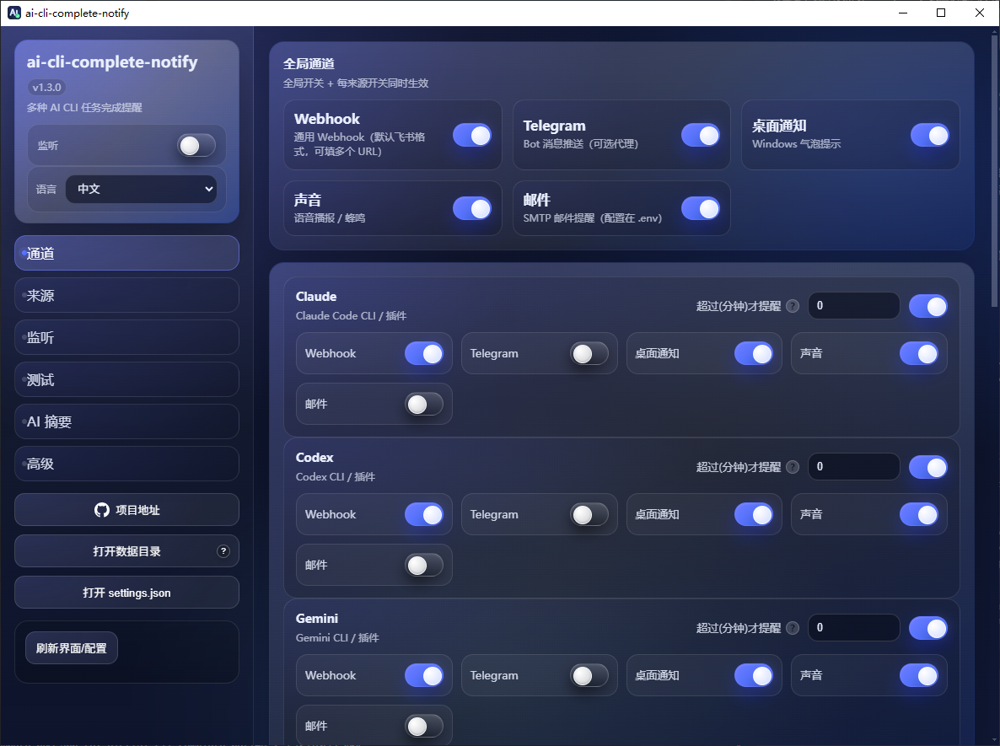
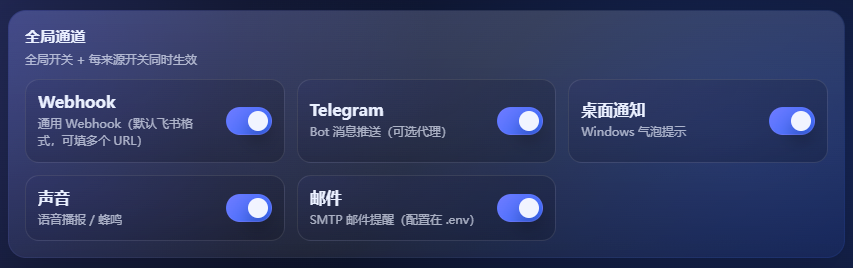
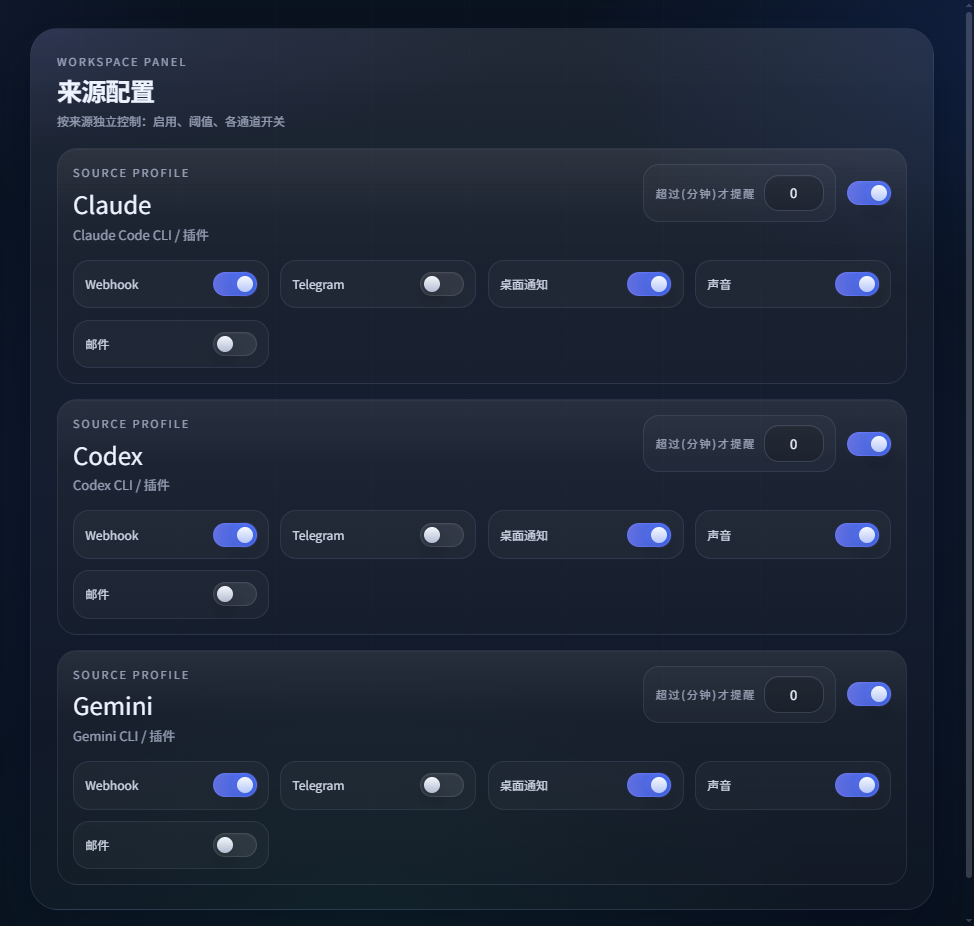
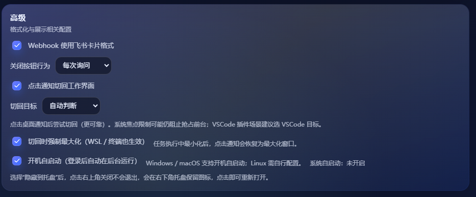

<div align="center">


# AI CLI Complete Notify (v1.4.0)


English | [中文](README_zh.md)



</div>

### 📖 Introduction

An intelligent task completion notification tool for Claude Code / Codex / Gemini, supporting multiple notification channels and flexible configuration options. Get notified automatically through various methods when AI assistants complete long-running tasks, so you don't have to wait in front of your computer.

**Supported Notification Methods:**

📱 Webhook (Feishu/DingTalk/WeCom) • 💬 Telegram Bot • 📧 Email (SMTP)

🖥️ Desktop Notifications • 🔊 Sound/TTS Alerts • ⌚ Smart Band Alerts


## ✨ Key Features(For more detailed update logs, please refer to the end of the article)

- 🎯 **Smart Debouncing**: Automatically adjusts notification timing based on task type - 60s for tool calls, only 15s without tool calls
- 🔀 **Source Control**: Independent enable/disable and threshold settings for Claude / Codex / Gemini
- 📡 **Multi-Channel Push**: Support multiple notification methods simultaneously to ensure message delivery
- ⏱️ **Duration Threshold**: Only notify when tasks exceed the set duration to avoid frequent interruptions
- 👀 **Dual Mode Monitoring**: Support timer mode (`run`/`start-stop`) and log monitoring mode (for interactive CLI / VSCode)
- ?? **AI Summary (Optional)**: Generate a short summary quickly; fallback to the original task if it times out
- 🖥️ **Desktop Application**: GUI configuration with language switching, tray hiding, and auto-start
- 🔐 **Configuration Separation**: Runtime configuration separated from sensitive information for security

## 💡 Recommended Configuration

**Important**: For the best experience, it's recommended to grant AI assistants **full file read/write permissions** when using Claude Code / Codex / Gemini.

Benefits:
- ✅ Ensures task logs are correctly recorded to local files
- ✅ Monitoring functions can accurately capture task completion status
- ✅ More precise notification timing, avoiding false positives or missed notifications
- ✅ AI can better manage project files and configurations

## Important Notes

- Claude Code often splits a request into sub-tasks. To avoid spam, this tool only notifies after the whole turn completes.
- Log monitoring relies on a quiet period to confirm completion, so notifications are not instant (default 60s with tool calls, 15s without).
- If you need faster alerts: use `notify` or `run` for Codex/Gemini; for Claude Code, keep `watch` to wait for full-turn completion.

## 🚀 Quick Start

### Windows Users

1. Download the latest `ai-cli-complete-notify-x.x.x.zip` from [Releases](https://github.com/ZekerTop/ai-cli-complete-notify/releases)
2. Extract the archive and place it in any directory (e.g., `D:\Tools\`)
3. Copy `.env.example` to `.env` and fill in your notification configuration according to the requirements inside
4. Double-click to run the desktop application

### macOS / Linux Users

```bash
# Clone repository
git clone https://github.com/ZekerTop/ai-cli-complete-notify.git
cd ai-cli-complete-notify

# Install dependencies
npm install

# Configure environment variables
cp .env.example .env
# Edit .env file and fill in your notification configuration

# Run desktop application
npm run dev
```

## 🖥️ Desktop Application Usage

### Interface Overview

- **Top Bar**: Language switching, Watch monitoring toggle, window controls
- **Channel Configuration**: Configure Webhook, Telegram, Email, and other notification channels
- **Source Settings**: Set enable status and duration thresholds for Claude / Codex / Gemini separately
- **Monitoring Configuration**: Set polling interval and debounce time with smart adjustment support
- **Confirm keywords (optional)**: Watch-only. Used to detect when the AI asks for confirmation/approval/continue. Leave empty to use built-in defaults; comma-separated custom keywords (e.g., confirm,approve,allow).
- **Watch logs**: Persisted locally with one-click open and retention days.
- **Test Function**: Test whether each notification channel works properly
- **AI Summary**: Configure API URL / Key / Model and timeout fallback
- **Advanced Options**: Title prefix, close behavior, auto-start on boot, silent start (hide to tray on launch), click notification to return (best-effort; OS focus rules may block)

### Interface Preview








### Tray Function

After selecting "Hide to tray", the application minimizes to the system tray. The icon may be in the ^ collapsed area of the taskbar.
With silent start enabled, the app launches hidden in the tray without a balloon.

## 💻 Command Line Usage

> WSL note: CLI reminders work for webhook/Telegram/email. Desktop/sound/tray are Windows-only. Log monitoring works only when the AI CLI runs inside WSL (logs under `~/.claude`, `~/.codex`, `~/.gemini`). For WSL/CLI config, use `.env` for AI summary and Feishu card; `.env` overrides `settings.json`.

Note: For CLI usage from source (Node), run `npm install` first.

### Direct Notification

```bash
# Send notification immediately (ignore threshold)
node ai-reminder.js notify --source claude --task "Task completed"
```

### Log Monitoring Mode (Recommended)

```bash
# Windows (EXE)
ai-cli-complete-notify-<version>.exe watch --sources all --gemini-quiet-ms 3000 --claude-quiet-ms 60000

# macOS / Linux / WSL (Node)
node ai-reminder.js watch --sources all --gemini-quiet-ms 3000 --claude-quiet-ms 60000
```

### Auto Timer Mode

```bash
# Windows (EXE)
ai-cli-complete-notify-<version>.exe run --source codex -- codex <args...>

# macOS / Linux / WSL (Node)
node ai-reminder.js run --source codex -- codex <args...>
```

Note: `--` separates this tool's arguments from the real command to execute. `codex <args...>` is just the actual AI CLI invocation (you can replace it with `claude` or `gemini`).

### Manual Timer Mode

```bash
# Start timer
node ai-reminder.js start --source gemini --task "Build project"

# ...execute your task...

# Stop timer and send notification
node ai-reminder.js stop --source gemini --task "Build project"
```

### Common Parameters

- `--source` / `--sources`: Specify AI source (claude / codex / gemini / all)
- `--task`: Task description
- `--interval-ms`: Polling interval (milliseconds)
- `--gemini-quiet-ms`: Gemini debounce time (milliseconds)
- `--claude-quiet-ms`: Claude debounce time (milliseconds)
- `--force`: Force send notification, ignore threshold

## ⚙️ Configuration

### Environment Variables (.env)

Copy from `.env.example` and fill in your configuration:

```env
# Webhook configuration (supports Feishu/DingTalk/WeCom)
WEBHOOK_URLS=https://open.feishu.cn/open-apis/bot/v2/hook/XXXXX
# Feishu card format (true/false). .env overrides settings.json.
# WEBHOOK_USE_FEISHU_CARD=false

# Desktop notifications and sound
NOTIFICATION_ENABLED=true
SOUND_ENABLED=true

# Telegram Bot
TELEGRAM_BOT_TOKEN=your_bot_token
TELEGRAM_CHAT_ID=your_chat_id

# Email configuration (optional)
# EMAIL_HOST=smtp.example.com
# EMAIL_PORT=465
# EMAIL_SECURE=true
# EMAIL_USER=bot@example.com
# EMAIL_PASS=your_smtp_password
# EMAIL_FROM=AI Notify <bot@example.com>
# EMAIL_TO=you@example.com

# AI summary (optional)
# SUMMARY_ENABLED=false
# SUMMARY_PROVIDER=openai    # model platform: openai | anthropic | google | qwen | deepseek
# SUMMARY_API_URL=https://api.openai.com/v1/chat/completions
# SUMMARY_API_KEY=your_api_key
# SUMMARY_MODEL=gpt-4o-mini
# SUMMARY_TIMEOUT_MS=15000
# SUMMARY_PROMPT=You are a technical assistant. Output one short summary sentence.

# Custom paths (optional)
# AI_CLI_COMPLETE_NOTIFY_DATA_DIR=...
# AI_CLI_COMPLETE_NOTIFY_ENV_PATH=...
```

WSL/CLI quick toggles:

```env
# .env (WSL/CLI)
SUMMARY_ENABLED=true
WEBHOOK_USE_FEISHU_CARD=true
```

### Runtime Configuration (settings.json)

Configuration file location:
- **Windows**: `%APPDATA%\ai-cli-complete-notify\settings.json`
- **macOS / Linux**: `~/.ai-cli-complete-notify/settings.json`

This file is automatically managed by the desktop application and contains source enable status, thresholds, and other settings.


## 🔧 Development & Build

### Development Mode

```bash
npm run dev
```

### Build Release Version

```bash
# Windows executable
npm run dist

# Or use electron-builder
npm run dist:portable

# macOS / Linux
# Package on target system using electron-packager or electron-builder
```

## 📝 Usage Tips

- ⏱️ **Threshold function** requires timing data (via `run` / `start-stop` / `watch` mode), `notify` command ignores threshold and sends directly
- 🔗 **Webhook** uses Feishu post format by default; enable "Use Feishu card format for Webhook" in the Advanced tab if you want JSON cards (watch output will be included when available).
- 🚀 **Auto-start on boot** is configured in the "Advanced" tab (supports Windows / macOS)
- 🎯 **Smart debouncing** automatically adjusts wait time based on AI message type, improving notification accuracy
- 💡 **Monitoring mode** is suitable for long-term operation, recommend setting auto-start or keeping it running in a background terminal
- 💡 **EXE starts with Watch enabled by default**: toggle it in the top bar if you don?t need it.
- 🧭 **Click to return** is more reliable but still best-effort due to OS focus rules; for VSCode extensions choose the VSCode target and ensure VSCode is not minimized

## Changelog

- 1.4.0:
  - Confirm prompt alerts in Watch mode (custom keywords supported)
  - Watch logs persisted + open log + retention days
  - Watch auto-start when EXE opens
  - Desktop notifications upgraded: notification window UI optimization + click-to-return (focus target / force maximize)
  - Sound enhancements: custom sound file, TTS toggle, WSL playback via Windows PowerShell
  - Feishu card toggle via `.env` (WEBHOOK_USE_FEISHU_CARD) with `.env` priority
- 1.3.0:
  - Feishu card webhook with theme-aware logos
  - AI summary multi-provider + test + streaming parsing
  - Summary-only webhook with fallback output
  - UI refinements (close modal/checkbox/number steppers)
  - Watch log persistence
  - Default summary timeout 15s
- 1.2.0:
  - Fix tray-hide multi-instance issue
  - Add hints
  - Fix language switching
- 1.1.0:
  - Fix Claude Code full-turn completion detection to avoid subtask alerts
  - Adaptive debounce based on message type
- 1.0.0:
  - Initial release

## 🤝 Contributing

Issues and Pull Requests are welcome!

---

**Enjoy smart notifications and let AI work for you!** 🎉
