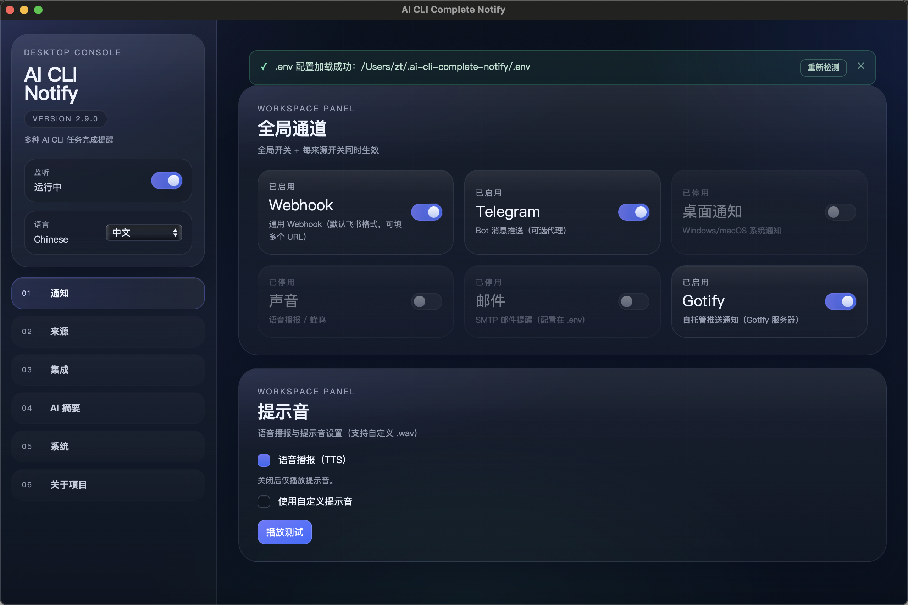
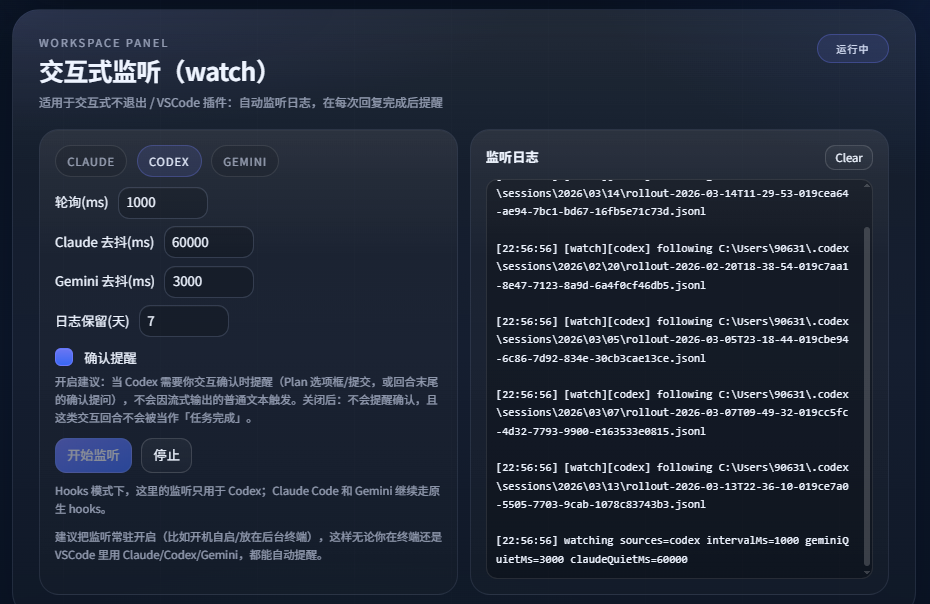
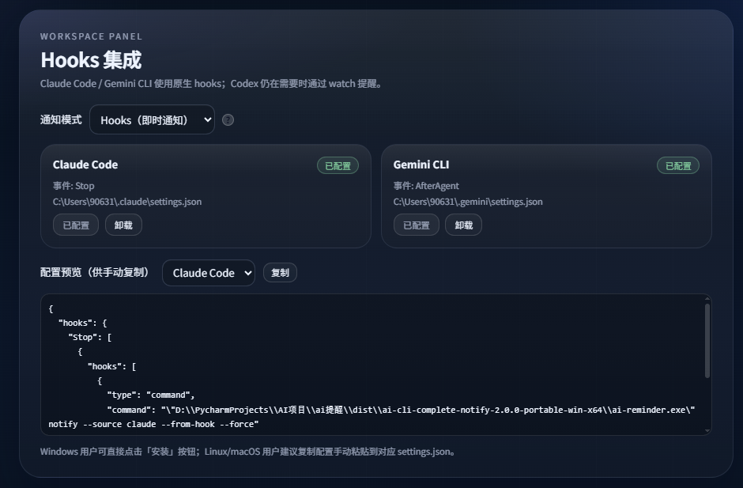

<div align="center">


# AI CLI Complete Notify (v2.1.0)


English | [中文](README_zh.md)

</div>

### 📖 Introduction

An intelligent task completion notification tool for Claude Code / Codex / Gemini, supporting multiple notification channels and flexible configuration options. Get notified automatically through various methods when AI assistants complete long-running tasks, so you don't have to wait in front of your computer.

**Supported Notification Methods:**

📱 Webhook (Feishu/DingTalk/WeCom) • 💬 Telegram Bot • 📧 Email (SMTP)

🖥️ Desktop Notifications • 🔊 Sound/TTS Alerts • ⌚ Smart Band Alerts


## ✨ Key Features(For more detailed update logs, please refer to the end of the article)

- 🎯 **Smart Debouncing**: Automatically adjusts notification timing based on task type - 60s for tool calls, only 15s without tool calls
- 🔀 **Source Control**: Independent enable/disable and threshold settings for Claude / Codex / Gemini
- 📡 **Multi-Channel Push**: Support multiple notification methods simultaneously to ensure message delivery
- ⏱️ **Duration Threshold**: Only notify when tasks exceed the set duration to avoid frequent interruptions
- 🪝 **Hooks + Watch Integration**: Claude Code / Gemini CLI can use native hooks for near-instant alerts, while Codex continues through log watching
- 🧠 **AI Summary (Optional)**: Generate a short summary quickly; fallback to the original task if it times out
- 🖥️ **Desktop Application**: GUI configuration with language switching, tray hiding, and auto-start
- 🔐 **Configuration Separation**: Runtime configuration separated from sensitive information for security

## 💡 Recommended Configuration

**Important**: For the best experience, it's recommended to grant AI assistants **full file read/write permissions** when using Claude Code / Codex / Gemini.

Benefits:
- ✅ Ensures task logs are correctly recorded to local files
- ✅ Monitoring functions can accurately capture task completion status
- ✅ More precise notification timing, avoiding false positives or missed notifications
- ✅ AI can better manage project files and configurations

## Important Notes

- Claude Code often splits a request into sub-tasks. To avoid spam, this tool only notifies after the whole turn completes.
- Log monitoring relies on a quiet period to confirm completion, so notifications are not instant (default 60s with tool calls, 15s without).
- For the fastest and cleanest alerts, prefer Hooks for Claude Code / Gemini CLI; keep Watch for Codex or as a general fallback mode.

## Hooks vs Watch

- **Hooks** use native lifecycle events emitted by the AI CLI itself. For Claude Code and Gemini CLI, that means reminders can fire closer to the real finish point instead of waiting for a quiet-period guess.
- **Hooks** do not require a long-running background watcher for those tools, which reduces idle overhead and lowers the chance of log-parsing false positives.
- **Watch** remains the universal fallback. It works well for Codex and for cases where hooks are not configured, but it depends on local logs and debounce time to infer that a turn has ended.
- In practice, Hooks were added mainly because Claude Code's `Stop` event and Gemini CLI's `AfterAgent` event provide more timely and accurate completion signals than watch-based log polling for those two tools. In the current integration, Codex still uses Watch as the main completion path.

## 🚀 Quick Start

### Windows Users

1. Download the latest `ai-cli-complete-notify-x.x.x.zip` from [Releases](https://github.com/ZekerTop/ai-cli-complete-notify/releases)
2. Extract the archive and place it in any directory (e.g., `D:\Tools\`)
3. Copy `.env.example` to `.env` and fill in your notification configuration according to the requirements inside
4. Double-click to run the desktop application

### macOS / Linux Users

```bash
# Clone repository
git clone https://github.com/ZekerTop/ai-cli-complete-notify.git
cd ai-cli-complete-notify

# Install dependencies
npm install

# Configure environment variables
cp .env.example .env
# Edit .env file and fill in your notification configuration

# Run desktop application
npm run dev
```

## 🖥️ Desktop Application Usage

### Interface Overview

- **Top Bar**: Language switching, Watch monitoring toggle, window controls
- **Channel Configuration**: Configure Webhook, Telegram, Email, and other notification channels
- **Source Settings**: Set enable status and duration thresholds for Claude / Codex / Gemini separately
- **Monitoring Configuration**: Set polling interval and debounce time with smart adjustment support
- **Confirm reminder (default: OFF)**: Effective only in Watch mode. When enabled, it triggers only when Codex shows an interactive choice prompt that requires your selection or submission (Plan mode); normal output text will not trigger it. Only one reminder is sent per turn: once a confirm reminder is triggered, that turn will not send a separate task-complete reminder.
- **Watch logs**: Persisted locally with one-click open and retention days.
- **Test Function**: Test whether each notification channel works properly
- **AI Summary**: Configure API URL / Key / Model and timeout fallback
- **Advanced Options**: Title prefix, close behavior, auto-start on boot, silent start (hide to tray on launch), click notification to return (best-effort; OS focus rules may block)

### Interface Preview




  


### Tray Function

After selecting "Hide to tray", the application minimizes to the system tray. The icon may be in the ^ collapsed area of the taskbar.
With silent start enabled, the app launches hidden in the tray without a balloon.

## 💻 Command Line Usage

> WSL note: CLI reminders work for webhook/Telegram/email, and sound can also work in WSL through Windows PowerShell. Desktop notifications and tray are Windows-only. Log monitoring works only when the AI CLI runs inside WSL (logs under `~/.claude`, `~/.codex`, `~/.gemini`). For WSL/CLI config, use `.env` for AI summary and Feishu card; `.env` overrides `settings.json`.

Note: For CLI usage from source (Node), run `npm install` first.

On Windows portable builds:
- `ai-cli-complete-notify.exe` is the desktop GUI.
- `ai-reminder.exe` is the packaged CLI/sidecar and should be used for terminal commands.

### WSL Quick Command Guide (Copy & Run)

```bash
# 0) Windows PowerShell: verify WSL is installed
wsl -l -v

# 1) Enter your distro (Ubuntu example)
wsl -d Ubuntu
```

```bash
# 2) Install Node.js / npm inside WSL (Ubuntu example)
sudo apt update
sudo apt install -y nodejs npm
node -v
npm -v
```

```bash
# 3) Enter project and install deps (adjust path to your machine)
cd "/mnt/d/path/to/ai-cli-complete-notify"
npm install
cp .env.example .env
```

```bash
# 4) Start log watch mode (recommended for long-running use)
node ai-reminder.js watch --sources all --gemini-quiet-ms 3000 --claude-quiet-ms 60000

# 5) Wrap an AI command with automatic timing
node ai-reminder.js run --source codex -- codex <args...>
```

```bash
# 6) Keep watcher running in background (nohup option)
nohup node ai-reminder.js watch --sources all > ~/ai-cli-notify.watch.log 2>&1 &
tail -f ~/ai-cli-notify.watch.log
```

```bash
# 7) Optional: keep it in tmux (more stable)
sudo apt install -y tmux
tmux new -s ai-notify
# Run watch command inside tmux, then press Ctrl+b, d to detach
tmux attach -t ai-notify
```

```bash
# 8) Useful WSL <-> Windows path helpers
explorer.exe .
wslpath -w ~/.codex
```

Notes:
- In WSL, prefer webhook/Telegram/email channels; tray is a Windows GUI feature.
- For WSL CLI behavior, configure `.env` first (`.env` overrides `settings.json`).

### Direct Notification

```bash
# Send notification immediately (ignore threshold)
node ai-reminder.js notify --source claude --task "Task completed"
```

### Native Hooks Mode (Recommended for Claude Code / Gemini CLI)

```bash
# Check current hook status
node ai-reminder.js hooks status

# Install Claude Code hook
node ai-reminder.js hooks install --target claude

# Install Gemini CLI hook
node ai-reminder.js hooks install --target gemini

# Remove a hook
node ai-reminder.js hooks uninstall --target claude
```

Notes:
- Claude Code currently uses the native `Stop` hook event.
- Gemini CLI currently uses the native `AfterAgent` hook event.
- In the current integration, Codex completion reminders are still handled mainly through Watch mode.

### Log Monitoring Mode (Recommended)

```bash
# Windows (EXE)
ai-reminder.exe watch --sources all --gemini-quiet-ms 3000 --claude-quiet-ms 60000

# macOS / Linux / WSL (Node)
node ai-reminder.js watch --sources all --gemini-quiet-ms 3000 --claude-quiet-ms 60000
```

### Auto Timer Mode

```bash
# Windows (EXE)
ai-reminder.exe run --source codex -- codex <args...>

# macOS / Linux / WSL (Node)
node ai-reminder.js run --source codex -- codex <args...>
```

Note: `--` separates this tool's arguments from the real command to execute. `codex <args...>` is just the actual AI CLI invocation (you can replace it with `claude` or `gemini`).

### Manual Timer Mode

```bash
# Start timer
node ai-reminder.js start --source gemini --task "Build project"

# ...execute your task...

# Stop timer and send notification
node ai-reminder.js stop --source gemini --task "Build project"
```

### Common Parameters

- `--source` / `--sources`: Specify AI source (claude / codex / gemini / all)
- `--task`: Task description
- `--interval-ms`: Polling interval (milliseconds)
- `--gemini-quiet-ms`: Gemini debounce time (milliseconds)
- `--claude-quiet-ms`: Claude debounce time (milliseconds)
- `--force`: Force send notification, ignore threshold

## ⚙️ Configuration

### Environment Variables (.env)

Copy from `.env.example` and fill in your configuration:

```env
# Webhook configuration (supports Feishu/DingTalk/WeCom)
WEBHOOK_URLS=https://open.feishu.cn/open-apis/bot/v2/hook/XXXXX
# Feishu card format (true/false). .env overrides settings.json.
# WEBHOOK_USE_FEISHU_CARD=false

# Desktop notifications and sound
NOTIFICATION_ENABLED=true
SOUND_ENABLED=true

# Telegram Bot
TELEGRAM_BOT_TOKEN=your_bot_token
TELEGRAM_CHAT_ID=your_chat_id

# Email configuration (optional)
# EMAIL_HOST=smtp.example.com
# EMAIL_PORT=465
# EMAIL_SECURE=true
# EMAIL_USER=bot@example.com
# EMAIL_PASS=your_smtp_password
# EMAIL_FROM=AI Notify <bot@example.com>
# EMAIL_TO=you@example.com

# AI summary (optional)
# SUMMARY_ENABLED=false
# SUMMARY_PROVIDER=openai    # model platform: openai | anthropic | google | qwen | deepseek
# SUMMARY_API_URL=https://api.openai.com
# SUMMARY_API_KEY=your_api_key
# SUMMARY_MODEL=gpt-4o-mini
# SUMMARY_TIMEOUT_MS=15000
# SUMMARY_PROMPT=You are a technical assistant. Output one short summary sentence.

# Custom paths (optional)
# AI_CLI_COMPLETE_NOTIFY_DATA_DIR=...
# AI_CLI_COMPLETE_NOTIFY_ENV_PATH=...
```

WSL/CLI quick toggles:

```env
# .env (WSL/CLI)
SUMMARY_ENABLED=true
WEBHOOK_USE_FEISHU_CARD=true
```

### Runtime Configuration (settings.json)

Configuration file location:
- **Windows**: `%APPDATA%\ai-cli-complete-notify\settings.json`
- **macOS / Linux**: `~/.ai-cli-complete-notify/settings.json`

This file is automatically managed by the desktop application and contains source enable status, thresholds, and other settings.


## 🔧 Development & Build

### Development Mode

```bash
# Tauri dev mode (recommended)
npm run dev

# Frontend only
npm run dev:ui
```

### Build Release Version

```bash
# Default build: Tauri portable package
# Output:
#   dist/ai-cli-complete-notify-<version>-portable-win-x64/
#   dist/ai-cli-complete-notify-<version>-portable-win-x64.zip
npm run dist

# Explicit portable build
npm run dist:portable

# NSIS installer build (optional)
npm run dist:installer

# Build sidecar only
npm run build:sidecar
```

Windows notes:

- `npm run dist` now looks for Rust automatically from `CARGO_HOME`, `D:\cargo`, or `%USERPROFILE%\\.cargo`.
- If you still prefer the batch entry, `build-tauri.bat` defaults to the portable package.
- Use `build-tauri.bat installer` if you still need the NSIS installer.
- The portable package intentionally excludes `README.md` and `README_zh.md`; only the executables and required runtime files are shipped.

## 📝 Usage Tips

- ⏱️ **Threshold function** requires timing data (via `run` / `start-stop` / `watch` mode), `notify` command ignores threshold and sends directly
- 🔗 **Webhook** uses Feishu post format by default; "Use Feishu card format" only applies to Feishu. WeCom/DingTalk will use text format and validate success by `errcode`.
- 🚀 **Auto-start on boot** is configured in the "Advanced" tab (supports Windows / macOS)
- 🎯 **Smart debouncing** automatically adjusts wait time based on AI message type, improving notification accuracy
- 💡 **Monitoring mode** is suitable for long-term operation, recommend setting auto-start or keeping it running in a background terminal
- 💡 **EXE starts with Watch enabled by default**: toggle it in the top bar if you don?t need it.
- 🪝 **Hooks mode** is the preferred choice for Claude Code / Gemini CLI because it uses native completion events; when Hooks mode is enabled, Watch mainly remains for Codex.
- ✅ **Confirm prompt toggle guidance (default: OFF)**: turn it on if AI often asks “confirm/approve/continue”; keep it off if you only want final completion alerts without intermediate interruptions. Note: if you set `CODEX_COMPLETION_ONLY=1` in `.env`, Codex confirm alerts are disabled (set it to `0` or remove it).
- 🧭 **Click to return** is more reliable but still best-effort due to OS focus rules; for VSCode extensions choose the VSCode target and ensure VSCode is not minimized

## Changelog

> `v2.x` is the current Tauri-based desktop line. `v1.x` was the Electron-based line.

### 2.1.0

- Desktop notification popup migrated from HTA (mshta.exe) to PowerShell WPF, completely eliminating the white flash before popup appears.
- Added WPF assembly pre-warming on app startup, pre-loading PresentationFramework and related assemblies in the background to reduce first-popup latency.
- Desktop notifications now fire fully in parallel with Webhook and other channels, removing the previous headstart delay for faster popup response.
- Desktop notification countdown shortened to 3 seconds for less visual interruption.
- Popup UI refined: rounded card with shadow, thin animated progress bar, cleaner and more polished look.

### 2.0.1

- Major architecture migration from Electron to Tauri 2. Based on the current `dist/ai-cli-complete-notify-2.0.1-portable-win-x64/` output, the full portable desktop package is now roughly in the `40-50 MB` range, and the zip package is about `20 MB`.
- Desktop UI rebuilt with `React 18 + TypeScript + Tailwind CSS`, with the current bilingual settings console and simplified navigation structure.
- Node CLI kept intact as a standalone sidecar executable via `pkg`, so existing `node ai-reminder.js ...` workflows remain compatible.
- Build chain streamlined around `Vite + Tauri`, with separate frontend, sidecar, portable package, and optional installer outputs.
- Desktop runtime adapted for the new stack: tray behavior, close-to-tray flow, packaged sidecar invocation, and startup diagnostics all moved to the Tauri implementation.
- Current integration model clarified in the desktop app: Hooks were added mainly to improve reminder timing accuracy for `Claude Code` and `Gemini CLI`, while `Codex` currently continues to rely primarily on log watching for completion reminders.

### 1.5.3

- Webhook delivery now auto-detects `Feishu`, `DingTalk`, and `WeCom`, and sends the proper payload format for each platform.
- Webhook testing became more reliable by validating platform-specific success responses (`code` / `errcode`).

### 1.5.2

- Codex reminder flow was stabilized so interaction prompts trigger confirm alerts and real task completion triggers completion alerts.
- Confirmation content selection was made deterministic: options first, otherwise the current question or output.
- Fixed prompt text reuse across interaction boundaries to avoid completion alerts inheriting stale confirm content.
- Codex completion detection now prefers explicit `task_complete` events for faster and more stable final reminders.
- AI Summary API URL input was upgraded to support base URLs, auto-appended provider suffixes, live preview, and exact-URL override rules.

### 1.5.0

- Codex completion detection was hardened with pending-state handling, token-count grace, and a final-answer-first strategy to reduce premature alerts.
- Added Codex session locking, idle-session switching guards, and fallback flush behavior before the next user turn to reduce missed or cross-session notifications.
- Added `CODEX_COMPLETION_ONLY=1` and disabled confirm alerts by default to keep completion reminders clean.
- Improved tray restore behavior, reduced startup white-flash, and refined tray icon rendering.

### 1.4.3

- Added Watch-mode confirm alerts so Codex interaction prompts and plan-selection turns can notify without keyword matching.
- Added persistent watch logs, quick log opening, and retention-day control.
- Enabled Watch auto-start when the packaged Windows app launches.
- Improved completion timing for `gpt-5.3-codex` to avoid premature reminders.
- Upgraded desktop notification UX with a better notification window, click-to-return behavior, sound options, and WSL playback support via Windows PowerShell.
- Added `.env` control for Feishu card format with `.env` taking precedence.

### 1.3.0

- Added Feishu card webhook support with theme-aware logos.
- Added multi-provider AI Summary, summary testing, and streaming response parsing.
- Added summary-first webhook output with fallback to the original task content.
- Refined several UI details and added watch-log persistence.

### 1.2.0

- Fixed multi-instance issues when hiding to tray.
- Added more in-app guidance.
- Fixed language switching behavior.

### 1.1.0

- Fixed Claude Code full-turn completion detection so subtasks no longer trigger premature alerts.
- Added adaptive debounce based on message type.

### 1.0.0

- Initial public release.

## 🤝 Contributing

Issues and Pull Requests are welcome!

---

**Enjoy smart notifications and let AI work for you!** 🎉
