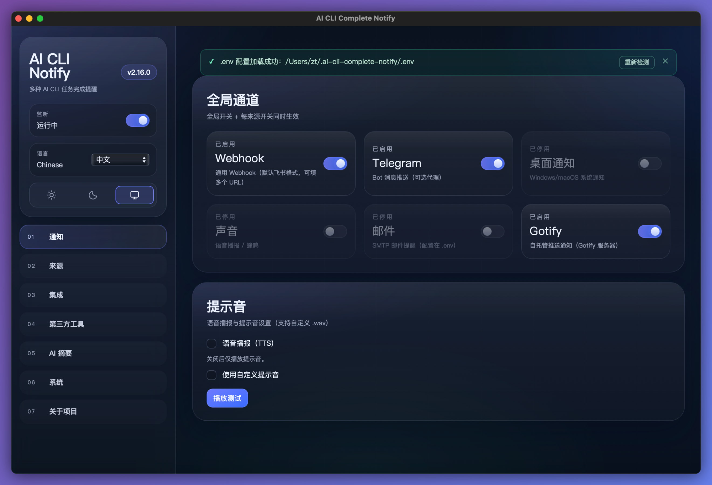
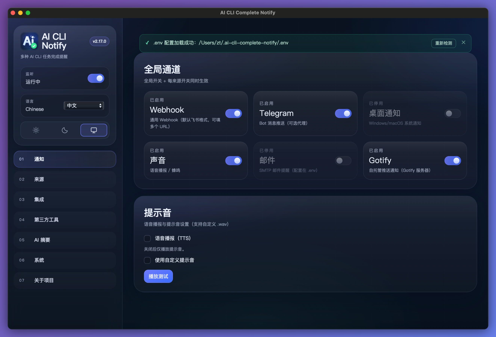
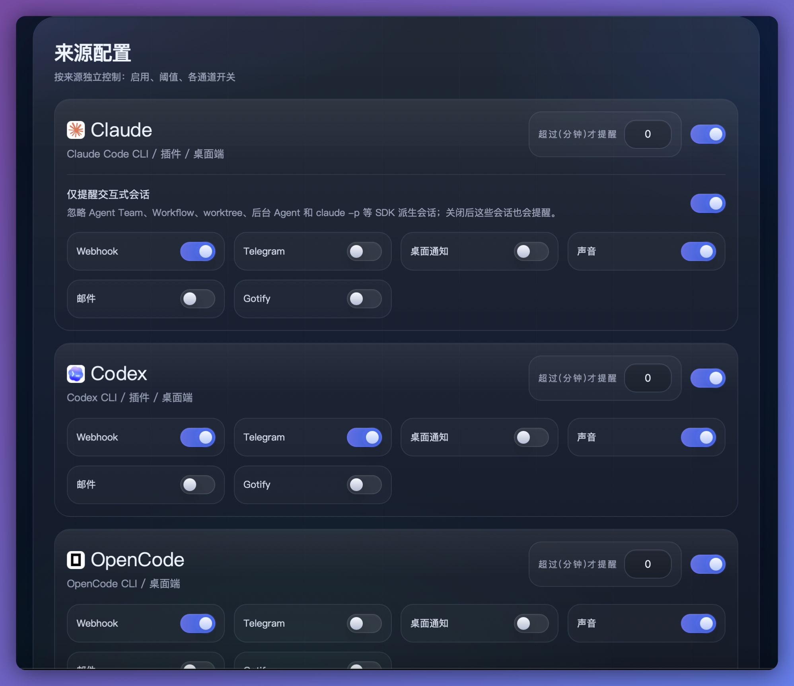
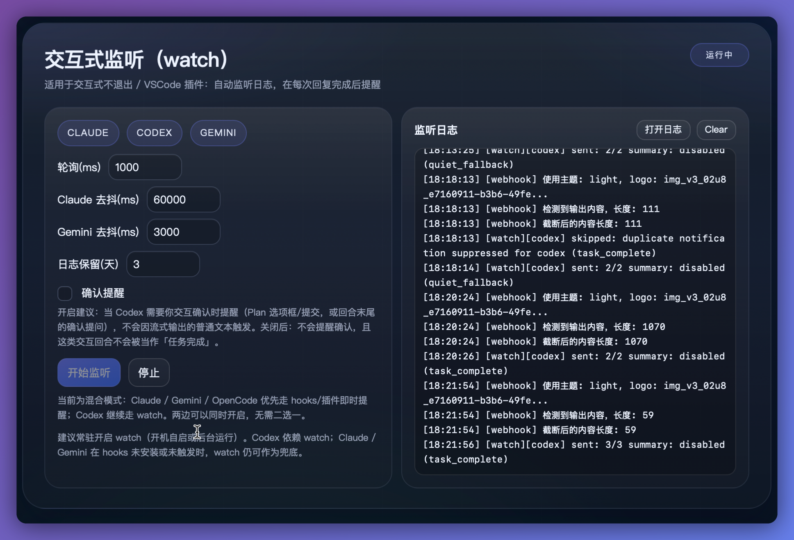
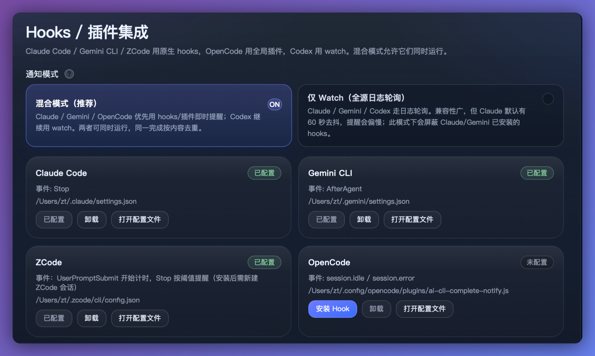
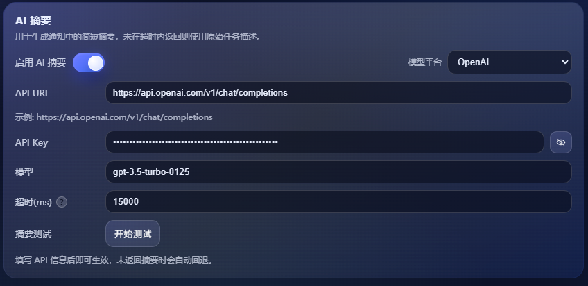
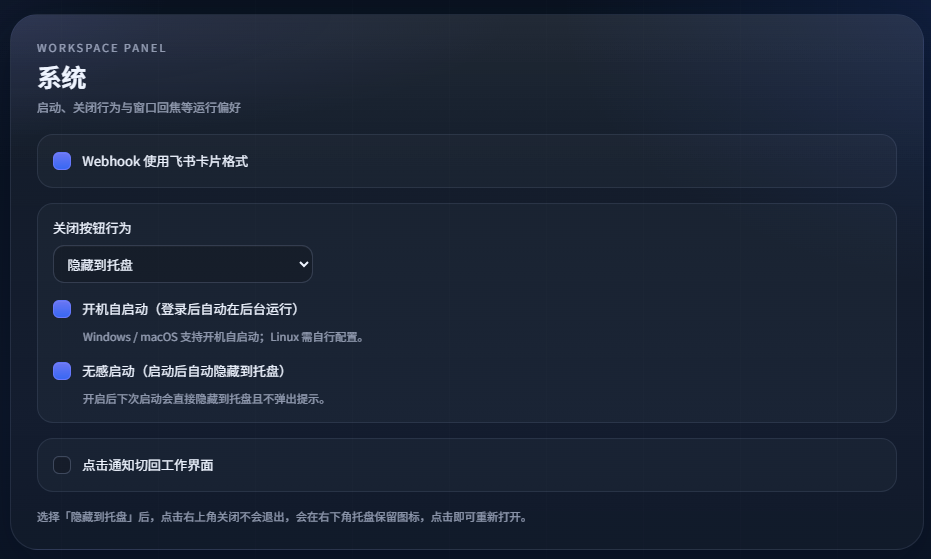
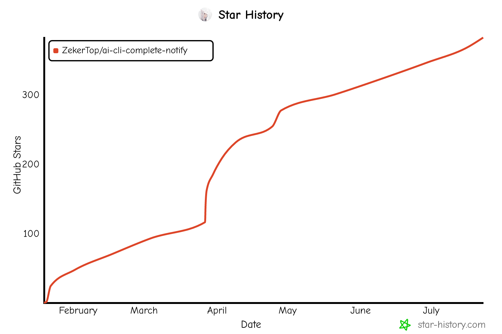

<div align="center">


# AI CLI Complete Notify (v2.17.0)


[](https://github.com/ZekerTop/ai-cli-complete-notify/releases/latest)

English | [简体中文](README_zh.md) | [繁體中文](README_zh-TW.md) | [한국어](README_ko.md) | [日本語](README_ja.md)


</div>

## Sponsors

> [👉 Want to sponsor this project?](mailto:top.zeker@gmail.com)

<table>
  <tr>
    <td align="center" width="180">
      <a href="https://gptplus.uno"></a><br />
      <a href="https://gptplus.uno"><strong>gptplus.uno</strong></a>
    </td>
    <td><a href="https://gptplus.uno"><strong>gptplus.uno</strong></a> offers ChatGPT Plus / Pro purchase and upgrade guides, plan-selection advice, FAQs and self-service troubleshooting, with WeChat Pay and Alipay payment options. Thank you for supporting this open-source project.</td>
  </tr>
</table>

### 📖 Introduction

An intelligent task completion notification tool for Claude Code / Codex / OpenCode / Gemini / ZCode, supporting multiple notification channels and flexible configuration options. Get notified automatically through various methods when AI assistants complete long-running tasks, so you don't have to wait in front of your computer.

**Supported Notification Methods:**

📱 Webhook (Feishu/DingTalk/WeCom) • 💬 Telegram Bot • 📧 Email (SMTP)

🖥️ Desktop Notifications • 🔊 Sound/TTS Alerts • ⌚ Smart Band / Watch Alerts (via existing notification channels)


## ✨ Key Features(For more detailed update logs, please refer to the end of the article)

- 🎯 **Smart Debouncing**: Automatically adjusts notification timing based on task type - 60s for tool calls, only 15s without tool calls
- 🔀 **Source Control**: Independent enable/disable and threshold settings for Claude / Codex / OpenCode / Gemini / ZCode
- 📡 **Multi-Channel Push**: Support multiple notification methods simultaneously to ensure message delivery
- ⏱️ **Duration Threshold**: Only notify when tasks exceed the set duration to avoid frequent interruptions
- 🪝 **Hooks + Watch Integration**: Claude Code / Gemini CLI / ZCode can use native hooks, OpenCode can use a global plugin, while Codex continues through log watching
- 🧠 **AI Summary (Optional)**: Generate a short summary quickly; fallback to the original task if it times out
- 🖥️ **Desktop Application**: GUI configuration with language switching, tray hiding, and auto-start
- 🔐 **Configuration Separation**: Runtime configuration separated from sensitive information for security

## 💡 Recommended Configuration

**Important**: For the best experience, it's recommended to grant AI assistants **full file read/write permissions** when using Claude Code / Codex / OpenCode / Gemini. ZCode is not affected: it completes through its native `Stop` hook and has no Watch path, so it does not need these permissions.

Benefits:
- ✅ Ensures task logs are correctly recorded to local files
- ✅ Monitoring functions can accurately capture task completion status
- ✅ More precise notification timing, avoiding false positives or missed notifications
- ✅ AI can better manage project files and configurations

## Important Notes

- Claude Code often splits a request into sub-tasks. To avoid spam, this tool only notifies after the whole turn completes.
- Log monitoring relies on a quiet period to confirm completion, so notifications are not instant (default 60s with tool calls, 15s without).
- For the fastest and cleanest alerts, prefer Hooks for Claude Code / Gemini CLI / ZCode and the global plugin for OpenCode; keep Watch for Codex or as a general fallback mode.
- Watch and Hooks **can run together in hybrid mode**. Recommended hybrid setup: Codex uses Watch; Claude Code / Gemini / OpenCode / ZCode use Hooks or plugins. If both paths fire for the same source, content-based dedupe keeps only one alert. **Watch-only** mode suppresses Claude/Gemini installed hooks so the two options stay distinct; hook-only sources (OpenCode, Herdr, ZCode) are never silenced by it.

## Hooks vs Watch

- **Hooks / plugin events** use explicit lifecycle events emitted by the AI CLI itself. For Claude Code, Gemini CLI, OpenCode, and ZCode, that means reminders can fire closer to the real finish point instead of waiting for a quiet-period guess.
- **Hooks** do not require a long-running background watcher for those tools, which reduces idle overhead and lowers the chance of log-parsing false positives.
- **Watch** remains the universal fallback. It works well for Codex and for cases where hooks are not configured, but it depends on local logs and debounce time to infer that a turn has ended.
- In practice, Hooks / plugin events were added because Claude Code's `Stop`, ZCode's `Stop`, Gemini CLI's `AfterAgent`, and OpenCode's `session.status` idle / `session.idle` / `session.error` events provide more timely and accurate completion signals than watch-based log polling. In the current integration, Codex still uses Watch as the main completion path.

## 🚀 Quick Start

### Windows Users

1. Download the latest `ai-cli-complete-notify-<version>-portable-win-x64.zip` from [Releases](https://github.com/ZekerTop/ai-cli-complete-notify/releases)
2. Extract the archive and place it in any directory (e.g., `D:\Tools\`)
3. Copy `.env.example` to `.env` and fill in your notification configuration according to the requirements inside
4. Double-click to run the desktop application

### macOS / Linux Users

#### macOS: Install the DMG (Recommended)

1. Download the DMG matching your Mac from [GitHub Releases](https://github.com/ZekerTop/ai-cli-complete-notify/releases/latest):
   - Apple Silicon (M-series): `ai-cli-complete-notify_<version>_aarch64.dmg`
   - Intel: `ai-cli-complete-notify_<version>_x86_64.dmg`
2. Open the DMG and drag `ai-cli-complete-notify.app` into `Applications`.
3. On first launch, if macOS says the developer cannot be verified, right-click the app and choose **Open**.
4. The packaged app reads notification settings from `~/.ai-cli-complete-notify/.env`. On first launch it creates `.env.example` there when configuration is missing.

> Requires macOS 13.5 or later (the bundled Node.js runtime's minimum). Check **About This Mac** to identify your chip or processor. These are separate architecture-specific packages, not Universal binaries. Both include Node.js; installing the DMG does not require Node.js/npm or Rust/Cargo.

#### Run from Source (macOS / Linux)

The following steps are only needed for Linux, development, or users who prefer to build from source. Source/dev mode requires Node.js/npm and Rust/Cargo. Tauri calls `cargo` when running `npm run dev`; if `cargo --version` fails, install Rust from the [official Rust installation page](https://www.rust-lang.org/tools/install) first.

```bash
# Clone repository
git clone https://github.com/ZekerTop/ai-cli-complete-notify.git
cd ai-cli-complete-notify

# Verify Rust/Cargo is available
cargo --version

# Install dependencies
npm install

# Configure environment variables (source/dev mode)
cp .env.example .env
# Edit .env file and fill in your notification configuration

# Run desktop application
npm run dev
```

Optional: build a double-clickable macOS app from source:

```bash
# Build .app
npm run dist:mac:app

# Build .dmg for distribution
npm run dist:mac:dmg
```

## 🖥️ Desktop Application Usage

### Interface Overview

- **Top Bar**: Language switching, Watch monitoring toggle, window controls
- **Channel Configuration**: Configure Webhook, Telegram, Email, and other notification channels
- **Source Settings**: Set enable status and duration thresholds for Claude / Codex / OpenCode / Gemini / ZCode separately
- **Monitoring Configuration**: Set polling interval and debounce time with smart adjustment support
- **Confirm reminder (default: OFF)**: Effective only in Watch mode. When enabled, it triggers only when Codex shows an interactive choice prompt that requires your selection or submission (Plan mode); normal output text will not trigger it. Only one reminder is sent per turn: once a confirm reminder is triggered, that turn will not send a separate task-complete reminder.
- **Watch logs**: Persisted locally with one-click open and retention days.
- **Test Function**: Test whether each notification channel works properly
- **AI Summary**: Configure API URL / Key / Model and timeout fallback
- **Advanced Options**: Title prefix, close behavior, auto-start on boot, silent start (hide to tray on launch), hide the Dock icon (macOS only), click notification to return (best-effort; OS focus rules may block)

### Interface Preview








### Tray Function

After selecting "Hide to tray", the application hides its window and keeps running. On Windows, the icon may be in the taskbar's ^ collapsed area; on macOS, use the menu bar icon to reopen the window.
With silent start enabled, the app launches hidden in the tray without a balloon.

On macOS, enable **Advanced → Hide from Dock (show only in macOS menu bar)** to hide the Dock icon. This setting is off by default and is saved as `ui.hideDockIcon`; it is separate from silent start and close behavior. Click the menu bar icon, or choose **Show** from its menu, to reopen the window. If you use Ice or another menu bar manager and cannot find the icon, check its hidden sections and available menu bar space, then refresh the manager's layout.

## 💻 Command Line Usage

> WSL note: CLI reminders work for webhook/Telegram/email, and sound can also work in WSL through Windows PowerShell. Desktop notifications and tray are Windows-only. Log monitoring works only when the AI CLI runs inside WSL (logs under `~/.claude`, `~/.codex`, `~/.gemini`). For WSL/CLI config, use `.env` for AI summary and Feishu card; `.env` overrides `settings.json`.

Note: For CLI usage from source (Node), run `npm install` first.

On Windows portable builds:
- `ai-cli-complete-notify.exe` is the desktop GUI.
- `ai-reminder.exe` is the packaged CLI/sidecar and should be used for terminal commands.

### Show Help

```bash
# Source / Node
node ai-reminder.js help

# Windows portable EXE
ai-reminder.exe help
```

### WSL Quick Command Guide (Copy & Run)

```bash
# 0) Windows PowerShell: verify WSL is installed
wsl -l -v

# 1) Enter your distro (Ubuntu example)
wsl -d Ubuntu
```

```bash
# 2) Install Node.js / npm inside WSL (Ubuntu example)
sudo apt update
sudo apt install -y nodejs npm
node -v
npm -v
```

```bash
# 3) Enter project and install deps (adjust path to your machine)
cd "/mnt/d/path/to/ai-cli-complete-notify"
npm install
cp .env.example .env
```

```bash
# 4) Start log watch mode (recommended for long-running use)
node ai-reminder.js watch --sources all --gemini-quiet-ms 3000 --claude-quiet-ms 60000

# 5) Wrap an AI command with automatic timing
node ai-reminder.js run --source codex -- codex <args...>
```

```bash
# 6) Keep watcher running in background (nohup option)
nohup node ai-reminder.js watch --sources all > ~/ai-cli-notify.watch.log 2>&1 &
tail -f ~/ai-cli-notify.watch.log
```

```bash
# 7) Optional: keep it in tmux (more stable)
sudo apt install -y tmux
tmux new -s ai-notify
# Run watch command inside tmux, then press Ctrl+b, d to detach
tmux attach -t ai-notify
```

```bash
# 8) Useful WSL <-> Windows path helpers
explorer.exe .
wslpath -w ~/.codex
```

Notes:
- In WSL, prefer webhook/Telegram/email channels; tray is a Windows GUI feature.
- For WSL CLI behavior, prefer `.env` for webhook and summary-related settings; global channel switches already saved in the desktop app still follow `settings.json`.

### Direct Notification

```bash
# Send notification immediately (ignore threshold)
node ai-reminder.js notify --source claude --task "Task completed"
```

### Native Hooks / Plugin Mode (Recommended for Claude Code / Gemini CLI / OpenCode / ZCode)

```bash
# Check current hook status
node ai-reminder.js hooks status

# Install Claude Code hook
node ai-reminder.js hooks install --target claude

# Install Gemini CLI hook
node ai-reminder.js hooks install --target gemini

# Install OpenCode global plugin
node ai-reminder.js hooks install --target opencode

# Install the Herdr plugin (herdr-ai-notify) and auto-configure it
node ai-reminder.js hooks install --target herdr

# Install the ZCode hook (user-level; enables ZCode's hooks runner automatically)
node ai-reminder.js hooks install --target zcode

# Preview the hook / plugin file that will be written
node ai-reminder.js hooks preview --target opencode

# Remove a hook / plugin
node ai-reminder.js hooks uninstall --target claude
node ai-reminder.js hooks uninstall --target herdr
```

Notes:
- Claude Code currently uses the native `Stop` hook event.
- Gemini CLI currently uses the native `AfterAgent` hook event.
- OpenCode currently uses a global plugin and listens to `session.status` idle / `session.idle` / `session.error`.
- ZCode uses hooks only, has no Watch path, and is disabled by default (`sources.zcode.enabled`). Installation registers `UserPromptSubmit` and `Stop` process hooks in the user-level `~/.zcode/cli/config.json` and enables `hooks.enabled`. Existing settings and other hooks are preserved; uninstall removes only this tool’s handlers.
- Enable the ZCode source, install its hook under **Hooks / Plugin Integration**, then start a new ZCode session. `UserPromptSubmit` starts the timer and `Stop` checks the duration threshold: `0` allows a notification on every completed turn; a positive value requires at least that many minutes. With a positive threshold, no notification is sent if the start time is missing. Reinstall the hook when upgrading from a Stop-only installation. ZCode channel preferences can be changed independently; delivery still requires the corresponding global channel to be enabled and configured.
- After installing or updating the ZCode hooks, **fully quit ZCode, reopen it, and start a new session** instead of continuing a session created before installation. Existing sessions may retain the hook configuration loaded at startup. If Test Notification succeeds but real tasks stay silent, confirm that the ZCode source and target channel are enabled, temporarily set the threshold to `0`, and test in a new session after restarting. Test Notification sends directly and bypasses the duration threshold; it does not verify actual hook execution.
- Herdr installs the [`herdr-ai-notify`](https://github.com/8liang/herdr-ai-notify) plugin through `herdr plugin install`, listens to `pane.agent_status_changed` (`done` / `blocked`), and writes `AI_REMINDER_PATH` into the plugin's `config.env` (auto-detected from the current executable path). Herdr notifications use their own `herdr` source, so titles are prefixed `[Herdr]` and its channels are configured separately (see `sources.herdr`). The community plugin forces delivery, so duration thresholds do not filter these events.
- In the current integration, Codex completion reminders are still handled mainly through Watch mode.

### Optional third-party tools (Herdr)

Open **Third-party tools → Herdr**. The page checks status automatically; use **① Check → ② Install and connect plugin…**, then enable notifications separately. Herdr is a standalone terminal tool for running and managing AI tools such as Codex in one window. Only tasks running inside Herdr send these notifications; Codex Desktop users do not need this integration. Requires Herdr ≥ 0.7.0, Bash and Python 3; the macOS app uses bundled Node. Ready/success is green; setup required is yellow. Turning Herdr off grays out and disables channel controls while preserving selections. Normal startup/watch does not probe Herdr, and opening this page does not install anything automatically. Custom plugin settings and existing AI integrations are preserved. Only selected, globally enabled channels are used. Using Herdr and a native integration for the same task may cause duplicate notifications. Click **?** to show or hide the Herdr explanation; **Plugin repository** opens [herdr-ai-notify](https://github.com/8liang/herdr-ai-notify), and the contributor link opens [8liang](https://github.com/8liang).

```bash
# Explicit plugin status (ordinary hooks status does not run Herdr)
node ai-reminder.js hooks status --target herdr
# Configuration does not enable this app's Herdr notifications
node ai-reminder.js hooks install --target herdr
# Enable only after reviewing duplicate-notification risks
node ai-reminder.js config --set '{"sources":{"herdr":{"enabled":true}}}'
```

### Log Monitoring Mode (Recommended)

```bash
# Windows (EXE)
ai-reminder.exe watch --sources all --gemini-quiet-ms 3000 --claude-quiet-ms 60000

# macOS / Linux / WSL (Node)
node ai-reminder.js watch --sources all --gemini-quiet-ms 3000 --claude-quiet-ms 60000
```

### Auto Timer Mode

```bash
# Windows (EXE)
ai-reminder.exe run --source codex -- codex <args...>

# macOS / Linux / WSL (Node)
node ai-reminder.js run --source codex -- codex <args...>
```

Note: `--` separates this tool's arguments from the real command to execute. `codex <args...>` is just the actual AI CLI invocation (you can replace it with `claude` or `gemini`).

### Manual Timer Mode

```bash
# Start timer
node ai-reminder.js start --source gemini --task "Build project"

# ...execute your task...

# Stop timer and send notification
node ai-reminder.js stop --source gemini --task "Build project"
```

### Common Parameters

- `--source` / `--sources`: Specify AI source (claude / codex / opencode / gemini / zcode / all). `watch --sources all` currently covers Claude / Codex / Gemini; OpenCode and ZCode use the plugin / hook paths above.
- `--task`: Task description
- `--interval-ms`: Polling interval (milliseconds)
- `--gemini-quiet-ms`: Gemini debounce time (milliseconds)
- `--claude-quiet-ms`: Claude debounce time (milliseconds)
- `--force`: Force send notification, ignore threshold

### Diagnostics / Inspection

```bash
# Print settings.json, state file, and watch-log paths
node ai-reminder.js paths

# Print the current effective runtime config
node ai-reminder.js config

# Check whether .env exists; create .env.example when missing
node ai-reminder.js env-status --create-example
```

## ⚙️ Configuration

### Environment Variables (.env)

Copy from `.env.example` and fill in your configuration:

Where to put `.env`:

- **Windows portable build**: put it next to `ai-cli-complete-notify.exe`, same as previous versions.
- **Packaged macOS app (.app / .dmg)**: put it at `~/.ai-cli-complete-notify/.env`. Do not put it inside the `.app` bundle, and do not rely on the read-only `.dmg` volume.
- **Source/dev or CLI mode**: put it in the project root or in the data directory.
- Run `ai-reminder paths` to see the current data directory and recommended `.env` path. To fully override it, set `AI_CLI_COMPLETE_NOTIFY_ENV_PATH=/path/to/.env`.

On first launch, the packaged macOS app checks for `.env` automatically. If it is missing, the app creates `.env.example` in the data directory and shows a setup reminder; if `.env` exists, the app shows that the configuration loaded successfully. If Finder does not show `.env.example`, press `Command + Shift + .` to show hidden files, then copy `.env.example` to `.env` and fill in your settings.

```env
# Webhook configuration (supports Feishu/DingTalk/WeCom)
WEBHOOK_URLS=https://open.feishu.cn/open-apis/bot/v2/hook/XXXXX
# DingTalk custom robots: set the security keyword to "AI提醒"; every Webhook message includes it.
# Optional per-source overrides. A configured source uses only its own URLs.
# CLAUDE_WEBHOOK_URLS=https://example.com/claude-hook
# CODEX_WEBHOOK_URLS=https://example.com/codex-hook
# GEMINI_WEBHOOK_URLS=https://example.com/gemini-hook
# OPENCODE_WEBHOOK_URLS=https://example.com/opencode-hook
# ZCODE_WEBHOOK_URLS=https://example.com/zcode-hook
# Feishu card format (true/false). .env overrides settings.json.
# WEBHOOK_USE_FEISHU_CARD=false
# Webhooks send summary-only when AI summary succeeds by default.
# Turn this on to also include the original output.
# WEBHOOK_INCLUDE_OUTPUT_WHEN_SUMMARY=false
# Max characters for original output in non-card webhooks.
# WEBHOOK_OUTPUT_MAX_LENGTH=3000

# Desktop notifications and sound
# Used as defaults only when settings.json has not explicitly set these channel switches
NOTIFICATION_ENABLED=true
# Used as a default only when settings.json has not explicitly set the sound switch
SOUND_ENABLED=true

# Telegram Bot
# Keep the token private. For Unauthorized, run telegram-check and check the credential source first.
# Revoke it immediately if it appeared in a public screenshot, issue, or log.
TELEGRAM_BOT_TOKEN=your_bot_token
TELEGRAM_CHAT_ID=your_chat_id

# Email configuration (optional)
# EMAIL_HOST=smtp.example.com
# EMAIL_PORT=465
# EMAIL_SECURE=true
# EMAIL_USER=bot@example.com
# EMAIL_PASS=your_smtp_password
# EMAIL_FROM=AI Notify <bot@example.com>
# EMAIL_TO=you@example.com

# AI summary (optional)
# SUMMARY_ENABLED=false
# SUMMARY_PROVIDER=openai    # model platform: openai | anthropic | google | qwen | deepseek
# SUMMARY_API_URL=https://api.openai.com
# SUMMARY_API_KEY=your_api_key
# SUMMARY_MODEL=gpt-4o-mini
# SUMMARY_TIMEOUT_MS=30000
# SUMMARY_PROMPT=You are a technical assistant. Output one short summary sentence.

# Custom paths (optional)
# AI_CLI_COMPLETE_NOTIFY_DATA_DIR=...
# AI_CLI_COMPLETE_NOTIFY_ENV_PATH=...
```

WSL/CLI quick toggles:

```env
# .env (WSL/CLI)
SUMMARY_ENABLED=true
WEBHOOK_USE_FEISHU_CARD=true
```

<a id="telegram-get-your-token-and-chat-id"></a>

<details>
<summary><strong>📱 Telegram setup: Token, Chat ID and testing (click to expand)</strong></summary>

1. Open the verified [@BotFather](https://t.me/BotFather) account. Send `/newbot`, choose a name and a username ending in `bot`, and copy the returned Token. For an existing bot, use `/mybots`, select the bot, then **API Token**. Copy only the Token, without a URL or `bot` prefix. Keep it private; revoke it if exposed. [Official instructions](https://core.telegram.org/bots/features#botfather)
2. For personal notifications, open **your own bot's chat, not BotFather**, press **Start**, and send a fresh message such as `test123`. No reply is required. Open the following URL in your browser, replacing all of `<TOKEN>` and retaining the preceding `bot`:

   ```text
   https://api.telegram.org/bot<TOKEN>/getUpdates
   ```

3. Find the matching message's `message.chat.id`. In this example, the Chat ID is **`123456789`**, not `update_id` or the Token's numeric prefix:

   ```json
   {"ok":true,"result":[{"update_id":987654321,"message":{"chat":{"id":123456789,"type":"private"},"text":"test123"}}]}
   ```

   Do not share the credential-bearing URL; close it afterwards and remember it may remain in browser history. An empty `result: []` means there are no pending updates: send a new message to the correct bot and refresh. Another connected program may have read the updates. A webhook conflict means another service receives this bot's updates; obtain the ID there or use a separate notification bot to avoid disrupting it. For groups, add the bot and send `/start@your_bot_username`, then use `message.chat.id`, preserving any minus sign. For channels, grant the bot posting permission and use `channel_post.chat.id` from a new channel post. [API reference](https://core.telegram.org/bots/api#getupdates)

4. Click **Open data directory** and edit `.env` with a plain-text editor. If absent, copy `.env.example` to `.env`, not `.env.txt`. Packaged macOS apps use `~/.ai-cli-complete-notify/.env`; press `Command + Shift + .` in Finder to show hidden files. See above for other platforms. Update existing entries rather than duplicating them:

   ```env
   TELEGRAM_BOT_TOKEN=your_bot_token
   TELEGRAM_CHAT_ID=your_chat_id
   ```

   The Channels page contains switches, not Token / Chat ID input fields.

5. If the browser connects but the app times out with `proxyEnabled: false`, set your proxy's **HTTP or Mixed port** in `.env`:

   ```env
   # Example only: replace 10818 with your actual HTTP / Mixed port
   HTTP_PROXY=http://127.0.0.1:10818
   HTTPS_PROXY=http://127.0.0.1:10818
   ```

   Do not add `export` or semicolons. Telegram supports HTTP(S) CONNECT proxies; a SOCKS5-only port will not work here. Keep the proxy running. Desktop-launched apps may not inherit terminal exports.

6. Save and fully restart the app. Enable Telegram globally and for the intended source, then save. In **Test notification**, click **Check Telegram** (since 2.17.0), or run `node ai-reminder.js telegram-check` from the source checkout. `ok: true` at `stage: getChat` confirms authentication and chat access; check that `botUsername` matches. A 401 at `getMe` requires checking `tokenSource`; a timeout requires checking connectivity, not assuming the Token is invalid. A `getChat` failure requires checking the receiving ID and chat access.
7. The check sends no messages. Select the intended source and send a test notification. Verify **both `OK telegram` in the app and an actual message in the target chat**. See [Telegram troubleshooting](docs/telegram-troubleshooting.md) for credential precedence details.

</details>

### Runtime Configuration (settings.json)

Configuration file location:
- **Windows**: `%APPDATA%\ai-cli-complete-notify\settings.json`
- **macOS / Linux**: `~/.ai-cli-complete-notify/settings.json`

This file is automatically managed by the desktop application and contains source enable status, thresholds, and other settings.


## 🔧 Development & Build

### Development Mode

```bash
# Tauri dev mode (recommended)
npm run dev

# Frontend only
npm run dev:ui
```

### Build Release Version

```bash
# Default build: platform-specific output
# Windows:
#   dist/ai-cli-complete-notify-<version>-portable-win-x64/
#   dist/ai-cli-complete-notify-<version>-portable-win-x64.zip
# macOS:
#   src-tauri/target/release/bundle/macos/ai-cli-complete-notify.app
npm run dist

# Windows portable build
npm run dist:portable

# Windows NSIS installer build (optional)
npm run dist:installer

# macOS .app
npm run dist:mac:app

# macOS .dmg (optional, for distribution)
npm run dist:mac:dmg

# Build sidecar only
npm run build:sidecar
```

Windows notes:

- `npm run dist` now looks for Rust automatically from `CARGO_HOME`, `D:\cargo`, or `%USERPROFILE%\\.cargo`.
- If you still prefer the batch entry, `build-tauri.bat` defaults to the portable package.
- Use `build-tauri.bat installer` if you still need the NSIS installer.
- The portable package intentionally excludes `README*.md`; only the executables and required runtime files are shipped.

macOS notes:

- Build with Node.js and Rust targeting the same architecture. The sidecar builder rejects a mismatched Node.js runtime; `--arch x64` alone does not cross-compile an ARM runtime. Maintainers can run **Actions → Build Intel macOS app** for native Intel builds, architecture checks, and regression tests.
- `npm run build:sidecar` generates the Tauri sidecar for the current Mac architecture, for example `src-tauri/binaries/ai-reminder-aarch64-apple-darwin` on Apple Silicon.
- `npm run dist:mac:app` outputs a double-clickable `.app`.
- `npm run dist:mac:dmg` outputs a `.dmg` for distribution.
- The packaged `.app` sends desktop notifications through the Tauri native notification plugin. macOS may ask for notification permission once; after allowing `ai-cli-complete-notify`, regular reminders should not trigger repeated AppleScript access prompts.
- For regular use, install the `.app` into `/Applications` from the `.dmg`. Running the app directly from Desktop or Downloads can trigger macOS "allow access to Desktop/Downloads" privacy prompts because the sidecar runtime and resources are inside the app bundle at that protected path.
- Public macOS distribution may still require Apple Developer code signing and notarization.

## 📝 Usage Tips

- ⏱️ **Threshold function** requires timing data (via `run` / `start-stop` / `watch` mode), `notify` command ignores threshold and sends directly
- 🔗 **Webhook** uses Feishu post format by default; "Use Feishu card format" only applies to Feishu. WeCom/DingTalk will use text format and validate success by `errcode`.
- ⌚ **Smart band / watch alerts** do not have a dedicated native channel yet; they are typically achieved indirectly through phone notification sync, webhook relays, Telegram, or email pipelines.
- 🚀 **Auto-start on boot** is configured in the "Advanced" tab (supports Windows / macOS)
- 🎯 **Smart debouncing** automatically adjusts wait time based on AI message type, improving notification accuracy
- 💡 **Monitoring mode** is suitable for long-term operation, recommend setting auto-start or keeping it running in a background terminal
- 💡 **EXE starts with Watch enabled by default**: toggle it in the top bar if you don?t need it.
- 🪝 **Hooks / plugin mode** is the preferred choice for Claude Code / Gemini CLI / OpenCode / ZCode because it uses explicit completion events. Hybrid mode is recommended: keep Watch on for Codex while Claude / Gemini / OpenCode / ZCode use hooks or plugins.
- ✅ **Confirm prompt toggle guidance (default: OFF)**: turn it on if AI often asks “confirm/approve/continue”; keep it off if you only want final completion alerts without intermediate interruptions. Note: if you set `CODEX_COMPLETION_ONLY=1` in `.env`, Codex confirm alerts are disabled (set it to `0` or remove it).
- 🧭 **Click to return** is more reliable but still best-effort due to OS focus rules; for VSCode extensions choose the VSCode target and ensure VSCode is not minimized

## Changelog

<details>
<summary>View version history</summary>

> `v2.x` is the current Tauri-based desktop line. `v1.x` was the Electron-based line.


### 2.17.0

- Fixed stale inherited variables overriding an explicitly selected `.env`. Added **Check Telegram** in Test notification and `node ai-reminder.js telegram-check` to verify the token and chat without sending messages. See [Telegram troubleshooting](docs/telegram-troubleshooting.md) (Issue #37).
- Updated the app and tray logo: the dot above “i” is now a tilted bell with ringing waves. Added the logo to the left of the app name and aligned the title, version badge, and subtitle.
- Added background update checks at startup and every hour while the app is running, using the latest public stable GitHub release. A red dot on the version badge indicates an update; click the badge to open About Project for version details and download links. Manual rechecks remain available; updates are not downloaded or installed automatically.
- Added a 10-second update-check timeout and prevented overlapping requests. Failed background checks preserve a previously detected update indicator.
- Fixed scroll position carrying over between sections. Switching sections now returns the content to the top.
- Added ZCode as a source disabled by default, installed with `node ai-reminder.js hooks install --target zcode`. `UserPromptSubmit` records each turn’s start and `Stop` checks its duration. Timers are isolated by project and session; repeated Stop events keep the first completion time and are deduplicated. Start a new ZCode session after upgrading the hook.
- ZCode hooks no longer force delivery past the duration threshold; invalid or non-completion events do not send completion alerts. Supports source channels, `ZCODE_WEBHOOK_URLS`, and AI summaries. No Watch path is added, and Watch-only mode does not suppress ZCode hooks.
- Added consistent source logos and desktop labels for Claude and Codex. Codex uses the blue logo with its whitespace compensated. About Project now uses wrapping source icons with names on hover, sharing the same source list as the settings page.
- Added the ZCode logo to Feishu cards. ZCode channel preferences remain editable when a global channel is off; actual delivery still requires that global channel to be enabled. Other sources retain their existing behavior.

### 2.16.0

- Simplified the layout: displayed the version beside the app title as a larger, bold rounded badge with a tinted background and border, without adding a separate row and removed the decorative Desktop Console, Workspace Panel and Source Profile headings to free up vertical space.
- Added global light, dark and system themes with sun, moon and monitor icon buttons below the language selector. The choice is remembered; system mode follows OS appearance changes.
- Added an optional Herdr page with notifications off by default, independent channels and duplicate-notification confirmation; existing AI integrations remain unchanged.
- Automatically check status when entering the page, with numbered check/install buttons, green success and yellow setup hints. Turning notifications off disables and grays out channel controls without clearing selections. Added a click-to-expand explanation, a community badge, and plugin/contributor GitHub links.
- Fixed Herdr discovery in macOS GUI install paths, unnecessary downloads when reconnecting an installed plugin, redundant activation of an already-enabled plugin, and messages not switching language. Preserved custom configuration, quoted paths and bundled-runtime delivery.

### 2.15.0

- Added a separate Intel Mac DMG named `ai-cli-complete-notify_2.15.0_x86_64.dmg`; the existing Apple Silicon `_aarch64.dmg` is unchanged. Added a native Intel build workflow and a runtime-architecture guard to prevent mixed-architecture packages.
- Fixed Codex Desktop forked chats replaying historical completion notifications. Fork-copied history stays muted until initialization finishes and the user sends a new message; only new branch turns can notify.
- Fixed Codex Watch treating Guardian approval-review sessions as completed user tasks. Object-valued `source.subagent` metadata, including `other: "guardian"`, now uses the existing subagent filter; normal parent-session completion notifications remain enabled. Thanks to [Bbbbqsh](https://github.com/Bbbbqsh) for [PR #34](https://github.com/ZekerTop/ai-cli-complete-notify/pull/34).
- Added the macOS **Hide from Dock** option, off by default, with the saved preference applied at startup. The menu bar icon remains the entry point when the Dock icon is hidden. Thanks to [8liang](https://github.com/8liang) for [PR #31](https://github.com/ZekerTop/ai-cli-complete-notify/pull/31).
- Improved Telegram `401 / Unauthorized` diagnostics with guidance to regenerate invalid or revoked Bot Tokens through `@BotFather` and revoke exposed tokens. This improves error reporting; it does not repair invalid credentials automatically ([Issue #33](https://github.com/ZekerTop/ai-cli-complete-notify/issues/33)).
- Added Vite client type declarations so TypeScript recognizes imported JPG assets without changing the interface.
- Added regression coverage for rewritten fork timestamps, history appended after Watch attaches, inherited turn detection without an explicit boundary, attach/seed races, a different workspace `cwd`, Guardian filtering with normal parent completion, and Telegram authentication diagnostics.

### 2.14.0

- Added the visible `AI提醒` marker to every Webhook payload and to the default test message, so DingTalk custom robots can use one keyword consistently for manual tests and real CLI completion alerts.
- Fixed empty Feishu test cards: cards without an AI summary now show `AI提醒 原文` with the task or output text, while successful summaries use `AI提醒 AI摘要` and preserve the existing original-output option.
- Webhook failures now surface the provider and returned reason in the test panel without exposing Webhook URLs or tokens.

### 2.13.0

- Codex Watch now follows native `thread_goal_updated` states for `/goal` tasks. Completion alerts are suppressed while a goal is `active` or `paused`, then sent once after it becomes `complete`, `blocked`, `usage_limited`, or `budget_limited`.
- Goal state is isolated by Codex session and turn, preserving normal tasks, multi-session notifications, explicit `request_user_input` confirm alerts, and compatibility with older Codex logs that do not emit Goal events.
- Fixed Claude Watch false completion alerts during `tool_use` / `tool_result` cycles. Tool results no longer reset the turn as human input, while tool calls and empty Assistant records no longer start or retain the completion timer; only the final non-empty Assistant text can trigger the completion alert.

### 2.12.0

- Fixed [Issue #18](https://github.com/ZekerTop/ai-cli-complete-notify/issues/18): top-level Codex sessions now notify independently, so a stale or interrupted VSCode session can no longer suppress completions from another session in the same workspace. Explicit subagent sessions remain filtered through Codex parent/child metadata.
- Codex confirm alerts are now triggered only by explicit `request_user_input` events. Normal `task_complete` responses that end with questions such as "Should I continue?" remain completion alerts.
- Added source-specific Webhook routing for [Issue #30](https://github.com/ZekerTop/ai-cli-complete-notify/issues/30). Claude, Codex, Gemini, and OpenCode can use `CLAUDE_WEBHOOK_URLS`, `CODEX_WEBHOOK_URLS`, `GEMINI_WEBHOOK_URLS`, and `OPENCODE_WEBHOOK_URLS` respectively.
- A source-specific environment variable or `sources.<source>.webhookUrls` now replaces the global URL set for that source. When no source-specific value is configured, the existing `WEBHOOK_URLS` and `channels.webhook.urls` behavior remains unchanged.
- Preserved existing Webhook formats, Feishu cards, AI summaries, output handling, Hook/Watch routing, deduplication, and all other notification channels, with regression tests covering separate Claude/Codex delivery and global fallback.

### 2.11.0

- Fixed [Issue #24](https://github.com/ZekerTop/ai-cli-complete-notify/issues/24) by adding a default-on Claude `Interactive sessions only` source option to suppress false completion alerts from SDK-derived Agent Team, Workflow, worktree, background Agent, and `claude -p` sessions.
- Claude Stop Hooks and Claude Watch now share the same bounded transcript-origin parser, using `entrypoint: "sdk-cli"` / `promptSource: "sdk"` for SDK sessions and preserving normal notifications for `entrypoint: "cli"` / `promptSource: "typed"` sessions.
- Unknown or unreadable transcript metadata continues through the existing notification path to avoid false suppression. Disable the option when headless `claude -p` completion alerts are required.
- Preserved existing Claude final-response extraction, failure alerts, Hook delay, Watch fallback, summaries, channels, and deduplication, with regression coverage for both Claude paths and the existing Gemini fixes.
- Added a GitHub Release update check to About Project. It checks automatically when the page opens, supports manual rechecks, displays the current and latest public versions, and sends both Windows and macOS users to GitHub Releases to choose their package.

### 2.10.0

- Improved hybrid routing so Claude and Gemini Hooks can run alongside Watch fallback, while Codex continues using Watch and OpenCode uses its plugin.
- Improved Gemini Hook/Watch deduplication across different working directories and scoped identical output by session.
- Reset stale Gemini Watch output when a new user turn starts or the active session file changes.
- Fixed Gemini Hook stdout output to always return valid JSON while routing notification diagnostics to stderr.
- Fixed Gemini CLI 0.49+ `AfterAgent` Hook installation to use the required nested schema. Existing legacy flat entries are migrated automatically, unrelated Hooks are preserved, and status/uninstall now recognize the valid structure without false positives.
- Fixed manual test notifications to bypass deduplication and display real per-channel success or failure details instead of the Gemini Hook `{}` response.
- Kept direct CLI notifications and the existing output behavior of other sources unchanged.

### 2.9.0

- Added support for OpenCode `session.status` idle events in the global plugin while keeping `session.idle` / `session.error` compatibility.
- OpenCode completion reminders can now use the latest assistant reply as the task text instead of always showing the generic `OpenCode Complete` message.
- Fixed the channel panel horizontal overflow that could show a blue horizontal bar after toggling Gotify.
- Added an About Project page after System with project information, author WeChat contact QR code, and optional Alipay / WeChat support codes.

### 2.8.0

- Added an AI Summary test path that sends a real test notification and reports both summary generation and notification delivery in the desktop UI.
- Improved AI Summary setup hints: the API URL input now explains base URL, exact endpoint, and trailing slash behavior.
- Fixed summary test JSON parsing by keeping webhook logs out of stdout, so webhook status output no longer breaks the desktop test result.
- Increased the AI Summary default timeout to 30 seconds and migrated the old 15-second default to reduce accidental fallback on slower API responses.
- Added success/error coloring to the AI Summary test result box.
- Added a Webhook option to include or hide the original output when an AI summary succeeds. When included, the AI summary and original output are separated with a divider and labeled clearly. When AI summary is disabled or fails, the original output is still kept to avoid blank notifications, and failures are shown inline, for example `AI Summary: request timed out, original output is shown`.
- Added original-output length limiting for non-card webhooks through `WEBHOOK_OUTPUT_MAX_LENGTH`.

### 2.7.0

- Added macOS desktop compatibility: the packaged `.app` now routes desktop notifications through Tauri native notifications to avoid repeated AppleScript access prompts, while CLI/source runs keep `osascript display notification` as a fallback. Sound alerts support `say` / `beep`, and custom audio files use `afplay`.
- Added the macOS Tauri sidecar build path, generating `ai-reminder-aarch64-apple-darwin` or `ai-reminder-x86_64-apple-darwin` for the current architecture so packaged macOS builds can find the sidecar correctly.
- Added macOS packaging scripts: `npm run dist:mac:app` builds a double-clickable `.app`, while `npm run dist:mac:dmg` builds a `.dmg` for distribution.
- Changed `npm run dist` to pick the output by platform: Windows keeps the portable package flow, while macOS builds the `.app`.
- Defined the packaged macOS `.env` location as `~/.ai-cli-complete-notify/.env` and added it to the `paths` output; Windows portable builds still support `.env` next to the exe.
- The packaged macOS app now checks `.env` at startup: when missing it creates `.env.example` and prompts the user to configure it, including a Finder hint to press `Command + Shift + .` when hidden files are not visible; when present it shows a successful load state.
- Fixed "open config file" behavior outside Windows; macOS now uses the system `open` command.
- Fixed the stale frontend sidebar version by injecting the version from `package.json` at build time instead of hard-coding it.
- Updated README / README_zh with macOS build instructions, `.app` / `.dmg` output notes, and the reminder that public macOS distribution may require code signing and notarization.

### 2.6.0

- Fixed premature Codex reminders when Superpowers / parallel subagents are used: Codex Desktop subagent sessions are now detected from `session_meta` and their completion/confirm reminders are suppressed, so the reminder is sent only by the parent conversation when the whole turn finishes.
- Fixed subagent detection for already-large Codex session files: when Watch attaches mid-session, it now reads the file head for `session_meta` instead of relying only on the tail seed window.
- Fixed unrelated Codex sessions suppressing each other: completion coordination is now grouped by workspace `cwd`, so a long-running turn in one project no longer blocks completion alerts from another project.
- Fixed Codex forked-chat replay reminders: copied history in a newly forked session is now treated as seed context only, so the new branch no longer replays completion alerts from the original branch.
- Fixed false Codex failure reminders caused by recoverable TUI background `WARN` lines, such as plugin/app-list/tool-suggestion 403 responses that do not stop the current turn.
- Added regression tests for multi-session parent/child-agent completion, Codex Desktop subagent metadata including file-head loading, cwd-grouped session coordination, forked-session history replay, and recoverable Codex TUI background warnings.

### 2.5.0

- Fixed Codex session watch reliability so completion reminders no longer depend only on `task_complete`.
- Serialized Codex session event processing to avoid missed notifications caused by JSONL event races.

### 2.4.0

- Desktop popup notifications on Windows no longer steal focus from the current input field. When the reminder appears while you are typing in apps such as WeChat, the caret should stay in the original textbox.
- Improved the notification mode selector in the Hooks panel: the hard-to-read dropdown has been replaced with directly visible mode cards, while the underlying `watch / hooks` behavior remains unchanged.

### 2.3.0

- Global channel toggles now stay in sync with per-source channel switches: turning a global channel off or back on updates the same channel under every source.
- `.env` defaults such as `SOUND_ENABLED` / `NOTIFICATION_ENABLED` no longer forcibly override global channel switches already saved in `settings.json`.
- Desktop notification no longer plays the Windows system sound — the Toast notification is now forced silent so it no longer triggers the OS default chime.
- Desktop notification fires in parallel with sound, so both arrive at the same time instead of sound lagging behind.
- Watch mode no longer sends premature notifications mid-task; it now always waits the full quiet period before notifying.
- Added a warning prompt when starting Watch mode without hooks installed, so users know accuracy may be reduced.
- Hook install/uninstall now shows a loading indicator and immediately refreshes the config preview on completion.
- Added "Open config file" button to each hook card and the preview section; clicking it opens the file in the system default editor.
- On startup, the app now checks hook installation status automatically. If any hooks are missing in Hooks mode, a yellow banner appears at the top warning that notifications may not fire at the right time; the banner updates immediately after any install or uninstall action.

### 2.2.0

- Added `OpenCode` as a fourth source with independent enable/threshold/channel settings.
- Added `hooks install --target opencode`, which writes a global plugin under `~/.config/opencode/plugins/` and triggers reminders from `session.status` idle / `session.idle` / `session.error`.
- OpenCode completion reminders now use event callbacks instead of watch-based guessing.
- The Hooks panel, Test panel, and CLI now fully support `OpenCode`, including install, status, and reminder testing.
- Tray behavior was refined with dedicated tray icons and more reliable hide-to-tray visibility and window restore behavior.

### 2.1.0

- Desktop notification popup migrated from HTA (mshta.exe) to PowerShell WPF, completely eliminating the white flash before popup appears.
- Added WPF assembly pre-warming on app startup, pre-loading PresentationFramework and related assemblies in the background to reduce first-popup latency.
- Desktop notifications now fire fully in parallel with Webhook and other channels, removing the previous headstart delay for faster popup response.
- Desktop notification countdown shortened to 3 seconds for less visual interruption.
- Popup UI refined: rounded card with shadow, thin animated progress bar, cleaner and more polished look.

### 2.0.1

- Major architecture migration from Electron to Tauri 2. Based on the current `dist/ai-cli-complete-notify-2.0.1-portable-win-x64/` output, the full portable desktop package is now roughly in the `40-50 MB` range, and the zip package is about `20 MB`.
- Desktop UI rebuilt with `React 18 + TypeScript + Tailwind CSS`, with the current bilingual settings console and simplified navigation structure.
- Node CLI kept intact as a standalone sidecar executable via `pkg`, so existing `node ai-reminder.js ...` workflows remain compatible.
- Build chain streamlined around `Vite + Tauri`, with separate frontend, sidecar, portable package, and optional installer outputs.
- Desktop runtime adapted for the new stack: tray behavior, close-to-tray flow, packaged sidecar invocation, and startup diagnostics all moved to the Tauri implementation.
- Current integration model clarified in the desktop app: Hooks were added mainly to improve reminder timing accuracy for `Claude Code` and `Gemini CLI`, while `Codex` currently continues to rely primarily on log watching for completion reminders.

### 1.5.3

- Webhook delivery now auto-detects `Feishu`, `DingTalk`, and `WeCom`, and sends the proper payload format for each platform.
- Webhook testing became more reliable by validating platform-specific success responses (`code` / `errcode`).

### 1.5.2

- Codex reminder flow was stabilized so interaction prompts trigger confirm alerts and real task completion triggers completion alerts.
- Confirmation content selection was made deterministic: options first, otherwise the current question or output.
- Fixed prompt text reuse across interaction boundaries to avoid completion alerts inheriting stale confirm content.
- Codex completion detection now prefers explicit `task_complete` events for faster and more stable final reminders.
- AI Summary API URL input was upgraded to support base URLs, auto-appended provider suffixes, live preview, and exact-URL override rules.

### 1.5.0

- Codex completion detection was hardened with pending-state handling, token-count grace, and a final-answer-first strategy to reduce premature alerts.
- Added Codex session locking, idle-session switching guards, and fallback flush behavior before the next user turn to reduce missed or cross-session notifications.
- Added `CODEX_COMPLETION_ONLY=1` and disabled confirm alerts by default to keep completion reminders clean.
- Improved tray restore behavior, reduced startup white-flash, and refined tray icon rendering.

### 1.4.3

- Added Watch-mode confirm alerts so Codex interaction prompts and plan-selection turns can notify without keyword matching.
- Added persistent watch logs, quick log opening, and retention-day control.
- Enabled Watch auto-start when the packaged Windows app launches.
- Improved completion timing for `gpt-5.3-codex` to avoid premature reminders.
- Upgraded desktop notification UX with a better notification window, click-to-return behavior, sound options, and WSL playback support via Windows PowerShell.
- Added `.env` control for Feishu card format with `.env` taking precedence.

### 1.3.0

- Added Feishu card webhook support with theme-aware logos.
- Added multi-provider AI Summary, summary testing, and streaming response parsing.
- Added summary-first webhook output with fallback to the original task content.
- Refined several UI details and added watch-log persistence.

### 1.2.0

- Fixed multi-instance issues when hiding to tray.
- Added more in-app guidance.
- Fixed language switching behavior.

### 1.1.0

- Fixed Claude Code full-turn completion detection so subtasks no longer trigger premature alerts.
- Added adaptive debounce based on message type.

### 1.0.0

- Initial public release.

</details>

## 🤝 Contributing

Issues and Pull Requests are welcome!

## Contributors

Thanks to everyone who has contributed to this project through code, documentation, feedback, and ideas.

<a href="https://github.com/ZekerTop/ai-cli-complete-notify/graphs/contributors">
 
</a>

## 🔗 Links

- [LINUX DO](https://linux.do/)

## 📈 Project Stats

<a href="https://www.star-history.com/?repos=ZekerTop%2Fai-cli-complete-notify&type=date&legend=top-left">
 
</a>

## License

This project is licensed under the [ISC License](LICENSE).

---

**Enjoy smart notifications and let AI work for you!** 🎉
