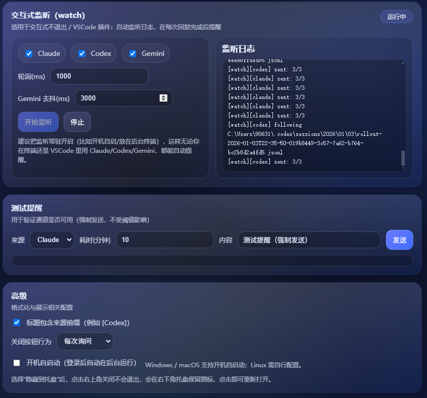

# AI CLI Complete Notify
版本：1.0.3

[English](README.md)

---

## 简介
面向 Claude / Codex / Gemini 的多通道任务完成提醒，支持耗时阈值、桌面端与 CLI、Webhook/Telegram/邮件/桌面/声音通知。

## 特性
- 分源控制：Claude/Codex/Gemini 独立启用与阈值。
- 多通道：通用 Webhook（飞书/钉钉/企微 JSON）、Telegram Bot、邮件（SMTP）、桌面通知、声音/TTS。
- 耗时阈值：只在超过设定分钟数时提醒。
- 双模式：计时（`run`/`start-stop`）或日志监听（适合交互式 CLI / VSCode）。
- 桌面端：语言切换、中英、托盘隐藏、开机自启、自动保存。
- 配置分离：`settings.json` 运行态；`.env` 存放密钥。

## 快速开始
**Windows**
1. 从 [Releases](https://github.com/ZekerTop/ai-cli-complete-notify/releases) 下载 `ai-cli-complete-notify.exe`。
2. 放到任意目录（如 `C:\Tools\`）。
3. 将 `.env.example` 复制为 `.env`，填写 Webhook/Token/SMTP。
4. 双击运行桌面应用（命令行也可用）。

**macOS/Linux**
```bash
git clone https://github.com/ZekerTop/ai-cli-complete-notify.git
cd ai-cli-complete-notify
npm install
cp .env.example .env   # Windows: copy .env.example .env
# 运行前在 .env 中填好 Webhook/Token/SMTP
npm run dev            # 开发模式运行桌面端
```

## 桌面端
- 顶部：语言切换、Watch 开关、关闭到托盘。
- 来源：启用/禁用、设置“超过多少分钟提醒”；自动保存。如手动改文件，可点 **重载** 重新读取配置。
- 高级：标题前缀、关闭行为、开机自启动（Win/macOS）。
- 托盘：选择“隐藏到托盘”后，图标可能在任务栏 ^ 折叠区。

界面示意：
- 
- 
- 
- 

## 命令行
```bash
# 直接通知（不看阈值）
node ai-reminder.js notify --source claude --task "done"

# 自动计时包裹
ai-cli-complete-notify.exe run --source codex -- codex <args...>

# 手动计时
node ai-reminder.js start --source gemini --task "build"
...do work...
node ai-reminder.js stop  --source gemini --task "build"

# 日志监听（自动检测来源）
ai-cli-complete-notify.exe watch --sources all --gemini-quiet-ms 3000
```
常用参数：`--source/--sources`、`--task`、`--interval-ms`、`--gemini-quiet-ms`、`--force`。

## 配置
`.env`（从 `.env.example` 复制）：
```env
WEBHOOK_URLS=https://open.feishu.cn/open-apis/bot/v2/hook/XXXXX
NOTIFICATION_ENABLED=true
SOUND_ENABLED=true
TELEGRAM_BOT_TOKEN=your_bot_token
TELEGRAM_CHAT_ID=your_chat_id
# EMAIL_HOST=smtp.example.com
# EMAIL_PORT=465
# EMAIL_SECURE=true
# EMAIL_USER=bot@example.com
# EMAIL_PASS=your_smtp_password
# EMAIL_FROM=AI Notify <bot@example.com>
# EMAIL_TO=you@example.com
# 可选固定路径：
# AI_CLI_COMPLETE_NOTIFY_DATA_DIR=...
# AI_CLI_COMPLETE_NOTIFY_ENV_PATH=...
```
运行时配置 `settings.json`：
- Windows: `%APPDATA%\ai-cli-complete-notify\settings.json`
- macOS/Linux: `~/.ai-cli-complete-notify/settings.json`

`.env` 已在 `.gitignore`，提交代码时不要上传个人密钥。

## 构建 / 发布
- 开发：`npm run dev`
- Windows EXE：`npm run dist` 或 `npm run dist:portable`
- macOS/Linux：在目标系统上用 electron-packager / electron-builder 打包。

## 提示
- 阈值需有计时数据（`run`/`start-stop`/`watch`）；`notify` 忽略阈值。
- 通用 Webhook 默认飞书 JSON，如目标格式不同需自行调整。
- 开机自启在“高级”中（Win/macOS）。
- 截图放 `docs/images/`，README 中用相对路径引用。

## License
ISC
